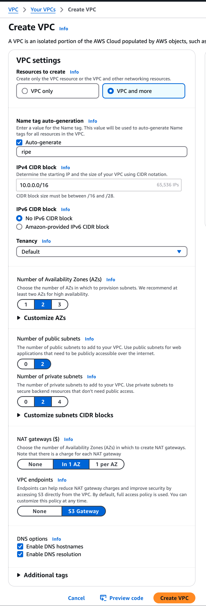
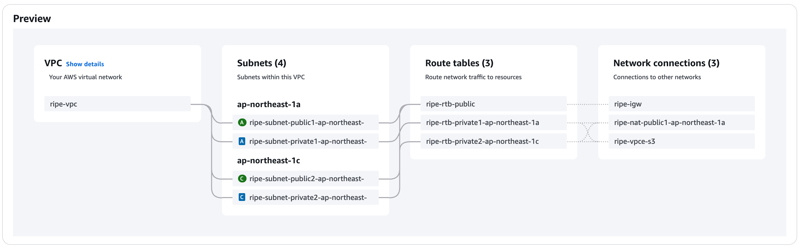

# Tutorial: Amplify Next.js app with Lambda that makes outbound calls from static IP addresses
Problem: We built a Next.js app hosted on AWS Amplify. The app now needs to call a payment API, but that API only accepts calls from whitelisted IP addresses. This presents a challenge since Amplify is designed to be serverless, where execution environments don't have guaranteed static IP addresses. This tutorial shows how to integrate a custom VPC to solve that problem.

## 1. Set up a Amplify Next.js app
Step 1 and 2 will set up a barebone app. First initialize a Next.js project for the frontend: `npx create-next-app@latest`.

[Set up your local environment for Amplify development](https://docs.amplify.aws/nextjs/start/account-setup/) if you haven't done so before. We will install the Amplify libraries:
```sh
npm add --save-dev @aws-amplify/backend@latest @aws-amplify/backend-cli@latest typescript
```
Now define a backend (`amplify/backend.ts`):
```js
import { defineBackend } from '@aws-amplify/backend';

defineBackend({});
```

At this point you should be able to locally start your backend (`npx ampx sandbox`) in one terminal while starting the frontend (`npm run dev`) in another.

## 2. Create a server action
In a typical Next.js app, business logic is executed in server actions. E.g., a server action may handle a payment request by updating databases and making third-party calls. For this tutorial, our server action will make an API call to retrieve its own IP address. Create a file `app/actions.ts`:
```js
'use server'

export async function getIP() {
  return fetch('https://api.ipify.org?format=json')
    .then(res => res.json())
}
```

And change `app/page.tsx` to call this server action when the page mounts:
```js
'use client'

import { useState, useEffect } from 'react'

import { getIP } from "./actions"

export default function Home() {
  const [ip, setIP] = useState('')

  useEffect(() => {
    getIP().then(json => json && setIP(json.ip))
  }, [])

  return (
    <main>
      <h1>Hello World!</h1>
      <p>IP address of component making API call: {ip}</p>
    </main>
  )
}
```

When you run this locally, you'll notice the IP address shown is the IP address of your location. That is, the server action is running on your local computer. When deployed in production, this server action will be running on an edge server somewhere, ideally close to the user. This is normally a good thing, but we can't call the payment API from the server action since it doesn't have a static IP address. For that we'll need a Lambda running in a specially configured VPC.

## 3. Create a Lambda using Amplify
Amplify has [built-in support](https://docs.amplify.aws/react/build-a-backend/functions/set-up-function/) for creating Lambdas with its `defineFunction` function. Unfortunately, as of this writing, `defineFunction` [doesn't support custom VPC](https://github.com/aws-amplify/amplify-backend/issues/1112). We therefore will build our Lambda using Amplify's [custom resources](https://docs.amplify.aws/react/build-a-backend/add-aws-services/custom-resources/).

First we define a handler for our Lambda. It's functionally similar to our server action earlier. We add a bit more error checking to help debug mistakes we may make later on. Create `amplify/functions/get-ip/handler.ts`:
```js
import type { APIGatewayProxyHandler } from 'aws-lambda'

export const handler: APIGatewayProxyHandler = async (event) => {
  console.log('event', event)

  let json = 'Fail to fetch IP address'

  try {
    const response = await fetch('https://api.ipify.org?format=json')
    if (response.ok) {
      json = await response.json()
    }
    else {
      json = response.statusText
    }
  }
  catch (error) {
    if (error instanceof Error) {
      json = error.message
    }
  }

  return {
    statusCode: 200,
    headers: { 'Content-Type': 'application/json' },
    body: JSON.stringify(json),
  }
}
```

Now update `amplify/backend.ts` to create a Lambda with this handler:
```js
import path from 'path'

import { defineBackend } from '@aws-amplify/backend'

import { Duration } from 'aws-cdk-lib'
import { Runtime } from 'aws-cdk-lib/aws-lambda'
import { NodejsFunction } from 'aws-cdk-lib/aws-lambda-nodejs'

const backend = defineBackend({})

const vpcStack = backend.createStack('vpc')

const lambda = new NodejsFunction(vpcStack, 'vpcLambda', {
  entry: path.join(__dirname, 'functions', 'get-ip', 'handler.ts'),
  runtime: Runtime.NODEJS_20_X,
})

backend.addOutput({
  custom: {
    'vpc-lambda-fn-name': lambda.functionName,
  }
})
```

With custom resources, we bypass the convenience functions provided by Amplify and go one level down to work directly using AWS's CDK. In this case we're using CDK's `NodejsFunction` to create our Lambda.

Information about Amplify's backend is normally summarized in the `amplify_outputs.json` file. The Next.js app will pick up information here for how to interact with the backend. Since Amplify doesn't know the specifics of our custom resource, we are manually appending those information using `backend.addOutput()`.

After this new backend is deployed, open `amplify_outputs.json` to find the function name of the deployed Lambda. Look it up in your AWS [Lambda dashboard](https://console.aws.amazon.com/lambda/home). Navigate to the dashboard for that Lambda and do a test run to see that it can retrieve its own IP address. The result should be an IP address owned by AWS.

## 4. Manually create a custom VPC
Up to now we haven't had to think about how our AWS resources are networked together. This is great because the "default" VPC (Virtual Private Cloud) usually just works. To have static IP address for outbound calls, however, requires more than the default VPC. We'll create a custom one.

Creating a custom VPC used to require you to tediously specify all the networking components and how they connect with each other. Fortunately AWS's VPC creation wizard now has fairly good default values, so our use case can be easily generated. You may still want to read the [use case explanation](https://docs.aws.amazon.com/vpc/latest/userguide/nat-gateway-scenarios.html#public-nat-internet-access) to better understand what you're building with the wizard though.

At the [VPC Dashboard](https://console.aws.amazon.com/vpcconsole/), click on the "Create VPC" button. You'll be creating a custom VPC with a NAT gateway. In the VPC creation wizard, choose "VPC and more" for us to fully customize the VPC. We'll be using most of the default settings (2 availability zones, 2 public subnets, 2 private subnets) but have a NAT gateway "In 1 AZ." You should also change the "Name tag auto-generation" to generate name tags based on your project name rather than a generic "project." This will help you identify the generated resources in the dashboard. Here's a screenshot of sample values:


A visualization of the custom VPC:


Once the VPC is created, find the generated NAT on the dashboard. It will have also generated a "Primary public IPv4 address." That is the static Elastic IP address that belongs to us.

## 5. Put Lambda inside VPC
Update our backend to retrieve the new VPC using `Vpc.fromVpcAttributes` and set our Lambda to run from inside this VPC's private subnet. The new `amplify/backend.ts` should look like:
```js
...
import 'dotenv/config'

const backend = defineBackend({})

const vpcStack = backend.createStack('vpc')

const vpc = Vpc.fromVpcAttributes(vpcStack, 'ImportVPC', {
  vpcId: process.env.VPC_ID!,
  availabilityZones: process.env.AVAILABILITY_ZONES!.split(','),
  privateSubnetIds: process.env.PRIVATE_SUBNET_IDS!.split(','),
})

const lambda = new NodejsFunction(vpcStack, 'vpcLambda', {
  entry: path.join(__dirname, 'functions', 'get-ip', 'handler.ts'),
  runtime: Runtime.NODEJS_20_X,
  vpc: vpc,
  vpcSubnets: { subnetType: SubnetType.PRIVATE_WITH_EGRESS },
})

backend.addOutput({
  custom: {
    'vpc-lambda-fn-name': lambda.functionName,
  }
})
```
(In standard CDK programming, VPCs are usually retrieved using `Vpc.fromLookup`. Unfortunately, in Amplify, this will trigger an error about "account/region are not specified at the stack level." The Amplify team has [decided](https://github.com/aws-amplify/amplify-backend/issues/999#issuecomment-1933204258) to not address this issue and recommend the use of `Vpc.fromVpcAttributes` instead.)

As you can see in the code, we will retrieve our custom VPC using attributes specified in environment variables. Install `dotenv` (`npm i dotenv`). Make a `.env` file with the following keys. You can find the specific values on your [VPC Dashboard](https://console.aws.amazon.com/vpcconsole/).
```sh
VPC_ID=vpc-xxxxxxxxxxxxxxxxx
AVAILABILITY_ZONES=us-east-1a,us-east-1c
PRIVATE_SUBNET_IDS=subnet-xxxxxxxxxxxxxxxxx,subnet-xxxxxxxxxxxxxxxxx
```

Run the Lambda again from the Lambda dashboard. You'll see that it's calling from our Elastic IP address! We can provide this address to the third-party payment API for whitelisting.

## 6. Call Lambda from Next.js
Now that we have a Lambda that makes outbound calls from a static IP address, we need some way of calling that Lambda from within our app. There are a lot of options, such as having the Lambda respond to database events, or listen for messages from SNS. The appropriate choice will depend on your use case. For illustration we will wrap the Lambda inside [Amplify's API framework](https://docs.amplify.aws/nextjs/build-a-backend/add-aws-services/rest-api/set-up-rest-api/), so we can call it like a REST API. This will also allow us to easily re-use [Amplify's auth system](https://docs.amplify.aws/nextjs/build-a-backend/add-aws-services/rest-api/customize-authz/) for access control. For example, if you're using IAM or Cognito for authentication, it's [well documented](https://docs.amplify.aws/nextjs/build-a-backend/add-aws-services/rest-api/customize-authz/) how to add authorization to the API gateway.

Wrapping a Lambda in a REST API is straightforward with the `LambdaRestApi` function. We will make this API publicly accessible and leave it to the reader to add restriction rules. Obviously, DO NOT DEPLOY A PUBLIC API TO PRODUCTION! Afterall, there's certainly a good reason why the API we're wrapping requires IP whitelisting.

Having created an API access point for the Lambda, we'll expose it via `amplify_outputs.json` to our Next.js app. Whereas we previously had outputted the Lambda function name in that file, we now replace it with the new API endpoint. Update `backend.ts` with
```js
import { LambdaRestApi } from 'aws-cdk-lib/aws-apigateway'

...
const api = new LambdaRestApi(vpcStack, 'restApiForVpcLambda', {
  handler: lambda,
})

backend.addOutput({
  custom: {
    // 'vpc-lambda-fn-name': lambda.functionName,
    API: {
      [api.restApiName]: {
        endpoint: api.url,
        region: vpcStack.region,
      },
    }
  }
})
```

When the new backend is compiled and deployed to the sandbox, you can look inside `amplify_outputs.json` to see what the URL endpoint is. Call it with your browser (or `curl`) and you'll see the Lambda output showing one of your allocated EIP addresses.

Our Next.js app can pick up the URL endpoint directly from `amplify_outputs.json` and call it with standard Javascript `fetch()`. But since we'll likely be using other Amplify frontend libraries, let's use that framework now. Create the file `app/amplifyConfig.ts` to configure Amplify frontend with the following [initialization code](https://docs.amplify.aws/nextjs/build-a-backend/add-aws-services/rest-api/set-up-rest-api/#initialize-amplify-api).
```js
import { Amplify } from 'aws-amplify'
import outputs from '@/amplify_outputs.json'

Amplify.configure(outputs)
const existingConfig = Amplify.getConfig()

Amplify.configure({
  ...existingConfig,
  API: {
    ...existingConfig.API,
    REST: outputs.custom.API
  }
})
```

The Amplify configuration above needs to be called before any Amplify function is used. We'll update the entire `app/actions.ts` file to call our Lambda API:
```js
'use server'

import { get } from 'aws-amplify/api';

import './amplifyConfig'

export async function getIP() {
  try {
    const restOperation = get({
      apiName: 'restApiForVpcLambda',
      path: ''
    })
    const response = await restOperation.response
    const json = await response.body.json() as { ip: string }

    return json
  } catch (error) {
    console.log('GET call failed: ', error)
  }
}
```

We're using Amplify's `get` function to [fetch data](https://docs.amplify.aws/nextjs/build-a-backend/add-aws-services/rest-api/fetch-data/) from our Lambda's REST API. Note that we're referring to the API by the name we've given to it (`restApiForVpcLambda`), rather than having to keep track of the URL. Amplify will figure it out based on its configuration.

With all that set up and your frontend running locally, you should be able to go to http://localhost:3000/ in your browser and see that your app is able to access an external API (https://api.ipify.org) from a static IP address that you control.
